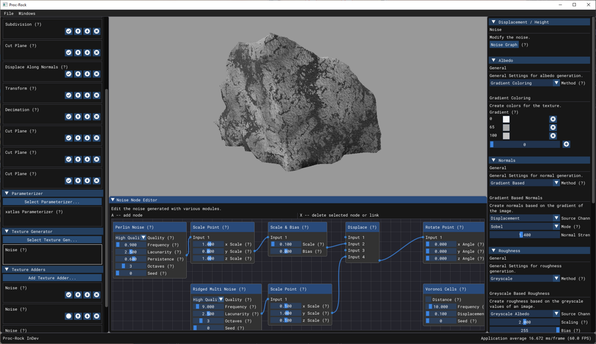
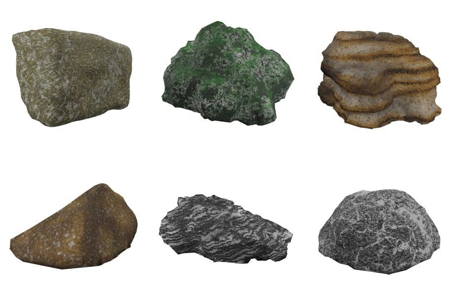
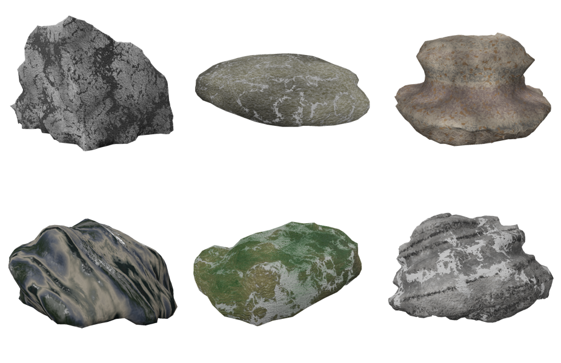

# Proc-Rock -  Procedural Generation of Rock Structures

## Overview
Proc-Rock is a program specialising in creating realistic-looking rocks by trying to map visual and geological features to procedural techniques. Based on the geological categorisation of rocks, having three default mappings gives the user the option to create various realistic-looking rocks without needing expertise in procedural techniques or even technical art. These mappings were made possible due to a highly customisable pipeline approach, node-based noise function graphs, boolean mesh geometry, and skin surfaces. Proc-Rock also creates reproducible results between operating systems and computers via simple text files, which store the parameters used for the creation.

## Features
- Simple and Advanced modi to create rocks
- Creates high resolution PBR materials
- Exports as .obj files with .png textures
- Can create very simple LOD's of the exported rocks
- Exports to simple .json files which always create the same rock (even between operating systems and computers)
- Simple GUI to preview the rocks and change parameters interactively
- Barebones CLI to create rocks from .json files and run benchmarks

## Examples

These examples can be created with the example files in the `example_files` folder.
They are numbered from left to right and top to bottom.

## Building
The repository uses vcpkg to handle dependencies. Simply run `setup.bat` (Windows) or `setup.sh` (OSX / Linux) to clone the vcpkg repo and install the dependencies.
The setup script needs `yasm` and `automake` to run on OSX / Linux.
Install these via your preferred package manager on your system.
The windows setup script does not have any dependencies.

After running the setup script, it should be easily buildable with a simple cmake call.
To run the application, you need to feed it the `app` folder directory as argument. 
It uses this folder to find the shaders and textures used.

## License
Proc-Rock is licensed under the GPL-3.0